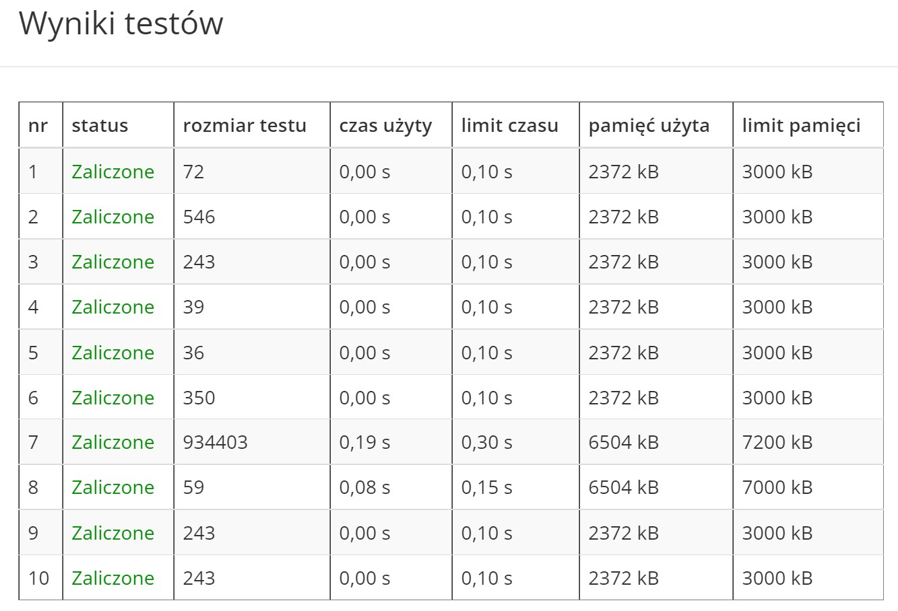

# Zadanie "Spotkanie TGRiDO" (Kopiec)

## Treść zadania

Ula organizuje bardzo ważne spotkanie dla Towarzystwa Gołębi Rasowych i Drobiu Ozdobnego, na które zaproszonych jest dokładnie ***n*** osób. W każdej chwili dowolne dwie osoby mogą wycofać się i porozmawiać na osobności. Te same dwie osoby mogą rozmawiać kilka (tyle ile chcą) razy podczas jednego spotkania. Każda osoba ma ograniczoną towarzyskość. Towarzyskość ***i***-tej osoby jest nieujemną liczbą całkowitą ***a<sub>i</sub>***. Oznacza to, że po dokładnie ***a<sub>i</sub>*** rozmowach ta osoba opuszcza spotkanie (i nie rozmawia już z nikim innym). Jeśli ***a<sub>i</sub>***=0, ***i***-ta osoba opuszcza spotkanie natychmiast po jego rozpoczęciu. Każda rozmowa zmniejsza towarzyskość osób, biorących w niej udział.

Ula chciałaby, żeby spotkanie było jak najbardziej produktywne, dlatego na podstawie informacji o towarzyskości poszczególnych osób chce określić, którzy ludzie powinni ze sobą rozmawiać, aby łączna liczba rozmów była jak największa. Należy dodatkowo założyć, że osoby bardziej towarzyskie (o aktualnie większym wskaźniku towarzyskości) będą chętniej i wcześniej zaczynać rozmowę niż osoby mniej towarzyskie.

## Wejście:
W pierwszej linii wejścia znajduje się liczba naturalna ***t*** - liczba testów. Kolejne ***t*** wierszy zawierają opisy przypadków testowych.\
Test składa się z liczby naturalnej ***n***, która oznacza liczbę uczestników spotkania. Po niej następuje ***n*** liczb całkowitych ***a<sub>1</sub>***,***a<sub>2</sub>***,...,***a<sub>n</sub>*** które są wskaźnikami towarzyskości kolejnych osób.

***2 ≤ n ≤ 200000***\
***0 ≤ a<sub>i</sub> ≤ 200000***

## Wyjście:
Na wyjściu dla każdego testu należy wypisać maksymalną liczbę możliwych rozmów. Dodatkowo w kolejnych liniach należy wyświetlić pary liczb (numery osób), w kolejności w jakiej osoby powinny ze sobą rozmawiać, przy założeniu, że najbardziej towarzyskie osoby rozpoczynają rozmowę wcześniej. Jeżeli istnieje więcej możliwych odpowiedzi należy wyświetlić odpowiedź pierwszą leksykograficznie. Osoby numerowane są od 1.

## Przykład:
### Wejście:
```
8
2 2 3
3 1 2 3
4 1 2 3 4
3 0 0 2
2 6 2
3 10 0 0
5 8 2 0 1 1
5 0 1 0 0 6
```
### Wyjście:
```
2
1 2
1 2
3
2 3
1 3
2 3
5
3 4
2 4
3 4
1 2
3 4
0
2
1 2
1 2
0
4
1 2
1 2
1 4
1 5
1
2 5
```
**UWAGA!** Zadanie należy rozwiązać wykorzystując samodzielnie zaimplementowany kopiec.



