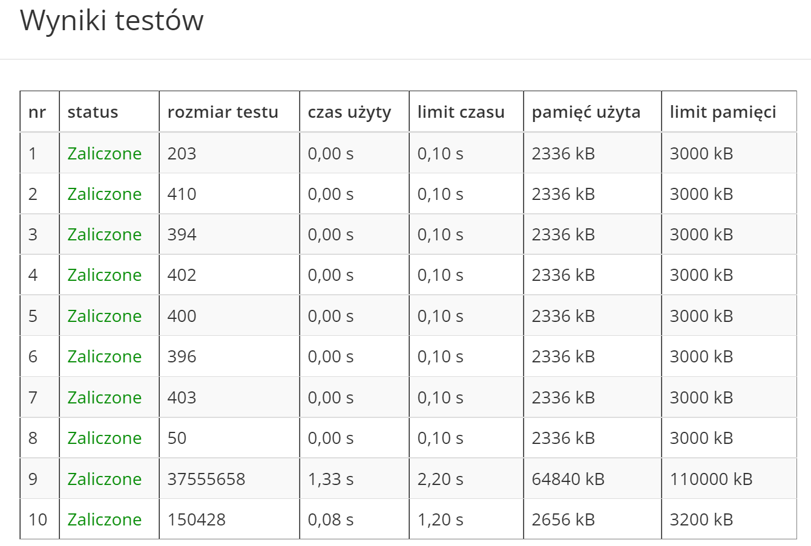

# Zadanie "Grządki" (Sortowanie)

## Treść zadania

Nie tylko ze swoich kwiatów Ula jest dumna. Od wielu lat prowadzi ekologiczne gospodarstwo i właśnie przygotowuje się do nowego sezonu warzywnego. Postanowiła dużo wcześniej rozplanować grządki w ogrodzie. Ogród warzywny Uli wygląda w ten sposób, że co każde dwa rządki zostawiane jest miejsce na ścieżkę. Od wielu lat Ula praktykuje sadzenie w dwóch sąsiadujących ze sobą rządkach dwóch rodzajów warzyw: jedno korzeniowe (z jadalną częścią pod ziemią) i jedno niekorzeniowe (kapusty, dyniowate, strączkowe i inne z jadalną częścią nad ziemią). W tym roku postanowiła uporządkować kolejność sadzonych warzyw malejąco względem trzech parametrów:

1. poziom zakwaszenia gleby idealny dla danego gatunku,
2. gęstość nasadu pomiędzy kolejnymi warzywami w milimetrach,
3. miesiąc rozpoczęcia nasadu.

Ula na podstawie listy warzyw korzeniowych i niekorzeniowych chciałaby zrobić nowe uporządkowanie na podstawie wymarzonej kolejności.

## Wejście:
W pierwszej linii wejścia znajduje się liczba całkowita ***n***, oznaczająca liczbę podwójnych grządek. W drugiej linii wejścia znajdują się trzy liczby 1, 2 i 3 oddzielone spacjami w dowolnej kolejności. Decydują one o kolejności kryteriów, według których porządkowane będą warzywa. W kolejnych ***2\*n*** liniach są wiersze opisujące roślinę. Na opis warzywa składa się kolejno jednowyrazowy napis z jego nazwą, jednej liczby zmiennoprzecinkowej ***z*** oznaczającej poziom zakwaszenia gleby, dwóch liczb całkowitych ***d*** i ***m***, oznaczajacych kolejno odległość nasadów w milimetrach oraz numer miesiąca nasadu. Miesiące numerowane są od 1. W pierwszych n liniach znajdują się opisy warzyw korzeniowych, a w kolejnych n liniach opisy warzyw niekorzeniowych.

***1 ≤ n ≤ 1000000***

## Wyjście:
Na wyjściu program powinien wypisać uporządkowane listy gatunków warzyw w parach według podanej kolejności kryteriów. Para powinna być wyświetlona w postaci: *nazwa1-nazwa2*, pary powinny być od siebie oddzielone znakiem białym. Całą listę należy wyświetlić w jednej linii. W przypadku dwóch gatunków, których wszystkie odpowiadające wartości są równe, należy zachować kolejność wystąpienia na liście.

## Przykład:
### Wejście:
```
5  
3 1 2  
marchew 3.5 345 12   
rzodkiewka 4.5 23 2  
pietruszka 3.5 120 12   
ziemniak 5.1 323 3  
seler 5.1 4000 5   
dynia 3.5 400 1   
kapusta 2.3 400 1   
szpinak 2.3 500 1   
papryka 2.3 600 1   
pomidor 3.5 400 1 
```   

### Wyjście:
```
marchew-dynia pietruszka-pomidor seler-papryka ziemniak-szpinak rzodkiewka-kapusta
```

**Uwaga! Nie można używać bibliotek STL. Zadanie powinno być samodzielną implementacją algorytmu sortującego.**


