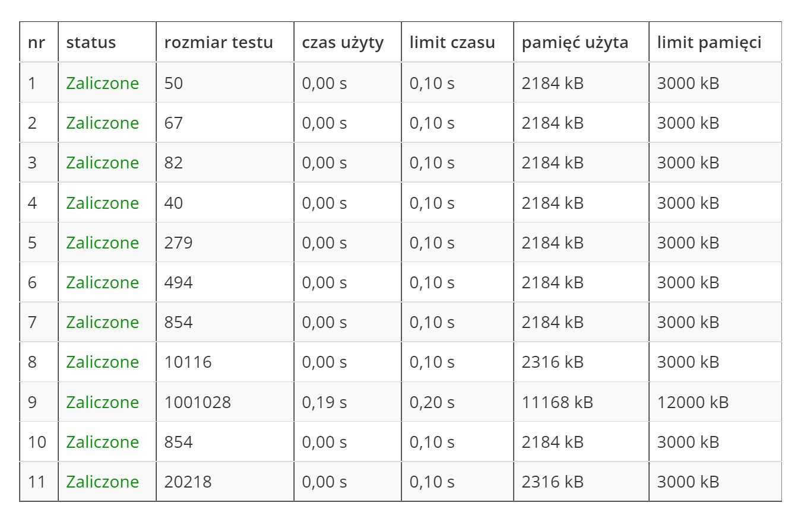

# Zadanie "Pożar" (Grafy)

## Treść zadania

Ula odwiedziła ostatnio swojego przyjaciela Mieszka, który właśnie wprowadził się do wspaniałej, starej posiadłości z ogromnym ogrodem. W centralnym miejscu ogrodu poprzedni właściciel wybudował wielki prostokątny labirynt o wymiarach ***n x m*** metrów. Na ścieżkach labiryntu rosną rzadkie, choć zaniedbane rośliny. Ula ze zgrozą zauważyła, że gdyby w którymś miejscu labiryntu (kwadracie o wymiarze jednego metra kwadratowego) zaprószono ogień, Mieszko nie ma opracowanego żadnego planu ewakuacji stamtąd. Ula postanowiła sprawdzić, czy w zależności od początkowej lokacji Mieszka i kwadratu zaprószenia ognia możliwe jest bezpieczne wydostanie się z labiryntu.

Mieszko może przemieścić się o 1 kwadrat w ciągu jednej minuty w jednym z czterech kierunków, natomiast każdy kwadrat, który się pali rozprzestrzenia ogień o jeden kwadrat w ciągu jednej minuty we wszystkich czterech kierunkach. Ani Mieszko ani ogień nie mogą wejść na kwadrat, w którym postawiona jest ściana.

## Wejście:
W pierwszej linii wejścia znajduje się liczba ***t*** oznaczająca liczbę testów. W kolejnych liniach znajduje się ***t*** testów. W pierwszej linii każdego testu znajdują się dwie liczby naturalne ***n*** i ***m***, oznaczające wymiary mapy. W kolejnych liniach znajduje się reprezentacja mapy zgodna z opisem (każdy wiersz ***n<sub>i</sub>*** przypadku testowego zawiera jeden rząd labiryntu):

\# - ściana\
. - dostępny kwadrat\
M - początkowa pozycja Mieszka w labiryncie, która jest dostępnym kwadratem\
O - kwadrat, który się pali\
W każdym przypadku testowym będzie dokładnie jedno M.

***1 ≤ n,m ≤ 1000***

## Wyjście:
Dla każdego testu należy wypisać wyraz "NIE", jeśli Mieszko nie może wyjść z labiryntu zanim ogień do niego dotrze lub liczbę całkowitą określającą minimalną liczbę minut potrzebną Mieszkowi bezpiecznie wyjść z labiryntu.

## Przykład:
### Wejście:
```
2
4 4
####
#MO#
#..#
#..#
4 4
####
#M..
#.O.
####
```
### Wyjście:
```
3
NIE
```

***Wyniki testów***
