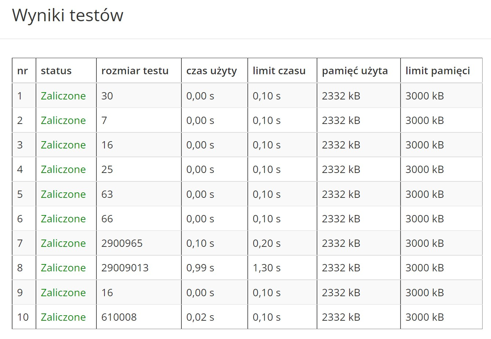

# Zadanie "Sad" (Algorytmy zachłanne i programowanie dynamiczne)

## Treść zadania

Zbliża się pora zrywania jabłek. Ula posiada sad z jabłoniami, w którym znajduje się ***n*** rzędów drzew (rzędy są numerowane od ***0***), po ***m*** jabłoni w każdym rzędzie (drzewa w rzędzie są numerowane od 0). Na każdym drzewie rośnie pewna liczba jabłek. Ula ma system zbierania owoców, który polega na tym, że danego dnia obrywa jabłka z jednego drzewa z każdego rzędu, zaczynając od wybranego drzewa w rzędzie 0. Po zerwaniu wszystkich owoców z drzewa przenosi się do kolejnego drzewa w następnym rzędzie, ale w taki sposób, by podczas przesuwania się z drabiną i koszami nie zmęczyć się za bardzo. Oznacza to, że zmieniając rząd zawsze wybiera drzewo sąsiadujące od góry lub po skosie z lewej lub prawej strony z tym, z którego właśnie zerwała jabłka (przykładowo, jeżeli zrywa jabłka w rzędzie 2 z drzewa o numerze 5, to w rzędzie 3 wybiera drzewo numer 4, 5 lub 6). Ula dąży do tego, żeby danego dnia zerwać jak najwięcej jabłek, dlatego musi się zastanowić, gdzie w rzędzie ***0*** zacząć i które drzewa wybierać na swojej drodze.

## Wejście:
Na wejściu program otrzymuje dwie liczby naturalne ***n*** i ***m***, które odpowiednio oznaczają liczbę rzędów sadu i liczbę drzew w rzędzie. Kolejne ***n*** linii zawiera ***m*** liczb. Każda z nich oznacza liczbę jabłek na drzewie.\
Należy przyjąć, że dane są podane od ostatniego rzędu, a więc rząd 0 to ten w ostatniej linii danych wejściowych.

***1 ≤ n ≤ 10000***\
***1 ≤ m ≤ 1000***\
***0 ≤ liczba jabłek ≤ 10000***

## Wyjście:
Na wyjściu program powinien wypisać dwie liczby. Pierwsza to numer drzewa, od którego Ula powinna zacząć zbiór, druga wartość to maksymalna liczba zebranych jabłek.\
W przypadku, gdy istnieje więcej możliwości, które kończą się tym samym wynikiem należy wypisać najniższy numer drzewa startowego.

## Przykład:
### Wejście:
```
4 3
3 2 8
10 3 2
1 4 10
4 1 2
```
### Wyjście:
```
2 23
```



