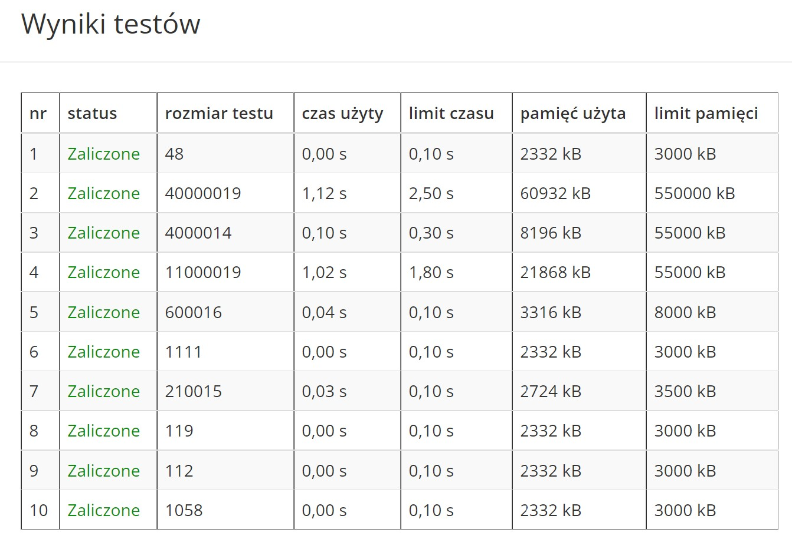

# Zadanie "Sejf" (Sortowanie w czasie liniowym)

## Treść zadania
Na przestrzeni wielu lat Uli udało się wyhodować kilka naprawdę wartościowych szczepów roślin. Receptury ich pielęgnacji oraz nasiona strzeże w sejfie ukrytym w przybudówce na tyłach ogrodu. Do sejfu prowadzi ***k*** drzwi, każde z nich zamknięte na klucz. Ula jednak bardzo martwi się o to, że takie zamki bardzo łatwo jest otworzyć wytrychem. Postanowiła poprosić swojego kolegę Mieszka o skonstruowanie dla niej dodatkowych szyfrów, które dopiero po ich odgadnięciu zwalniałyby mechanizm otwierania drzwi. Niestety ma do dyspozycji ograniczone środki i nie może obstawić w ten sposób każdego wejścia. Mimo to chciałaby wybrać jakąś korzystną opcję. Ula chciałaby, żeby trudność złamania szyfru rosła wykładniczo wraz z pokonywaniem kolejnych drzwi. Przykładowo jeżeli szyfry będą założone na drzwi numer 1, 2 i 4 (gdzie drzwi 1 to te najbliżej sejfu), to złamanie szyfru na drzwiach 1 powinno być 2 razy trudniejsze niż w drzwiach 2 oraz 8 razy trudniejsze niż w drzwiach 4.\
Mieszko w oparciu o wymagania i możliwości Uli przedstawił jej ***n*** propozycji rozstawienia szyfrów, z których Ula zdecyduje się wybrać spośród ***m*** najlepszych. Zakładamy, że rozstawienie jest lepsze od innego, jeżeli sumaryczna trudność złamania jego szyfrów jest większa.

## Wejście:
W pierwszej linii wejścia pojawią się 3 liczby naturalne ***n***, ***k*** oraz ***m***, gdzie ***n*** jest liczbą propozycji Mieszka, ***k*** liczbą drzwi, a ***m*** liczbą propozycji, które Ula będzie brała pod uwagę.\
W kolejnych ***n*** liniach pojawią się opisy ofert składające się ***k*** znaków, gdzie ***'o'*** oznacza drzwi bez szyfru, a ***'X'*** oznacza drzwi z szyfrem. Zakładamy, że od lewej znajdują się drzwi położone najbliżej sejfu.

***1 ≤ n ≤ 10000000***\
***1 ≤ k ≤ 20***\
***m ≤ n***

## Wyjście:
Na wyjściu program ma wypisać ***m*** pierwszych propozycji uporządkowanych od najlepszej.

## Przykład:
### Wejście:
```
7 5 3
XoooX
oXXXX
ooXoX
oooXX
XXooo
oXoXo
XooXo
```
### Wyjście:
```
XXooo
XooXo
XoooX
```
**Uwaga: Zadanie ma być samodzielną implementacją algorytmu sortowania w czasie liniowym.**



